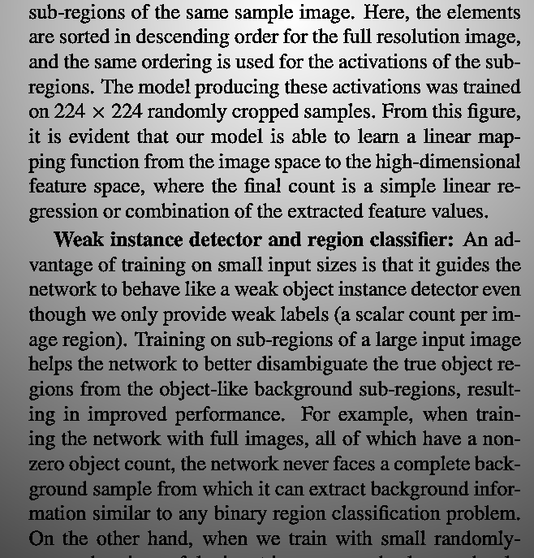
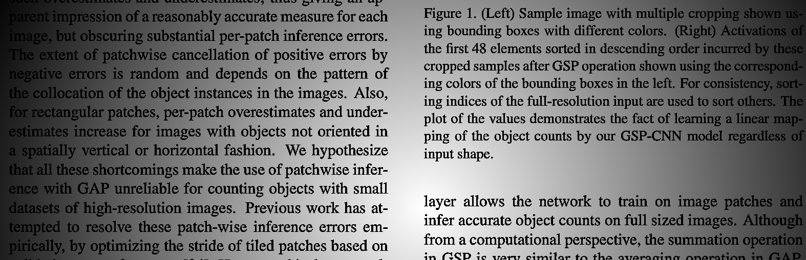

# adaptive-thresholding

## Data generator

for generating the data follow steps:

```bash
cd data
mkdir augmented_data
mkdir thresholded_references
python3 data_generator.py
```
Some of the generated (shaded) data:



For generating paths list for c++ program you need to run following:

```bash
cd data
python3 generate_augmented_paths.py
```

Then you can build and run your solution:

```bash
cmake . && make && ./adaptive-thresholding
```